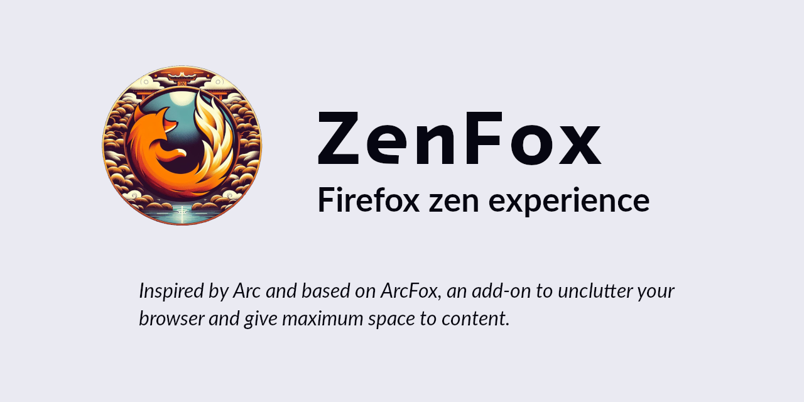

This is a fork of ArcFox intended to minimalism's lovers.
Expect fewer features, fewer buttons and fewer functionalities.

If you prefer the original that aims to resemble Arc Browser, project is here : https://github.com/betterbrowser/arcfox

# Installation

## Install Add-On

Use the official [Firefox Add-Ons store](https://addons.mozilla.org/firefox/addon/zenfox/).

## Install theme

To get started with customizing your Firefox experience, you need to enable some settings via about:config. Navigate to it by typing "about:config"
into the search bar of Firefox and set the value for "toolkit.legacyUserProfileCustomizations.stylesheets" to true. After that, we'll move on to
setting up your userChrome style :

1. Open your Firefox configurations by searching for "about:support".
2. Click on the "Open Folder" button next to "Profile Folder" to open it.
3. In this folder, look for a folder named "chrome". If you don't find one, create one.
4. Drop your ["userChrome.css"](https://raw.githubusercontent.com/CodeCadim/ZenFox/main/themes/userChrome.css) file (from themes folder) into the "chrome" folder.
5. Finally, restart Firefox for changes to take effect. Your customizations should now be live!

# Uninstall

1. Remove `(Firefox Profile)/chrome/userchrome.css`

2. Remove the 'ZenFox' extension from Firefox

3. Restart your Firefox session

# Donate to the original project

Support ArcFox and BetterBrowser in a financial way : donate to the developer [ko-fi](https://ko-fi.com/nikollesan) page

# License

ZenFox is based on Arcfox, so it is also distributed under [MIT License](./LICENSE).
